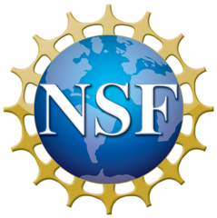

# About CS-POGIL

CS-POGIL is a community effort to bring *Process Oriented Guided Inquiry Learning (POGIL)* to computer science education. Our work builds on the broader POGIL Project, which began in chemistry in the 1990s and has since expanded across STEM disciplines.

In the early 2010s, faculty began adapting POGIL's team-based approach in CS courses. These grassroots efforts led to the first NSF-funded [CS-POGIL Project](https://www.nsf.gov/awardsearch/show-award/?AWD_ID=1044679), which focused on developing, piloting, and disseminating classroom activities for courses such as Data Structures, Algorithms, and Software Engineering. The project emphasized not only high-quality instructional materials, but also faculty workshops, conference presentations, and research to support implementation.

Building on that foundation, the [IntroCS-POGIL Project](https://www.nsf.gov/awardsearch/show-award/?AWD_ID=1626765) studied the adoption and implementation of POGIL in CS1 courses using enhanced professional development practices. Multi-institution collaborations strengthened both the research base and the growing instructor community.

CS-POGIL has grown beyond individual grants into a sustained, collaborative network of educators. Today, the community maintains a large and evolving collection of classroom activities spanning introductory through advanced topics. Workshops, conference sessions, and research publications continue to support instructors who want to increase student engagement, deepen conceptual understanding, and build collaborative problem-solving skills in their courses.

CS-POGIL exists to:

* Develop and share high-quality guided-inquiry activities for computer science
* Support faculty adoption through workshops, mentoring, and research
* Foster a welcoming community of educators committed to active learning

Whether you are new to POGIL or an experienced practitioner, we invite you to explore the materials, learn about the pedagogy, and join the CS-POGIL community.

## Sample CS Activities

The [EngageCSEdu](https://www.engage-csedu.org/) repository features several peer reviewed IntroCS-POGIL activities:

* CS1 Java
    * [Introduction to Java](https://www.engage-csedu.org/find-resources/introduction-java)
    &nbsp;|&nbsp; [activity pdf](https://www.engage-csedu.org/sites/default/files/IntroJava_Student.pdf)
    * [Boolean Logic](https://www.engage-csedu.org/find-resources/boolean-logic-java)
    &nbsp;|&nbsp; [activity pdf](https://www.engage-csedu.org/sites/default/files/BoolLogic_Student.pdf)
* CS1 Python
    * [Introduction to Python](https://www.engage-csedu.org/find-resources/introduction-python)
    &nbsp;|&nbsp; [activity pdf](https://www.engage-csedu.org/sites/default/files/IntroPython_Student.pdf)
    * [Conditions and Logic](https://www.engage-csedu.org/find-resources/conditions-and-logic-python)
    &nbsp;|&nbsp; [activity pdf](https://www.engage-csedu.org/sites/default/files/CondLogic_Student.pdf)

## Acknowledgments

{style="float: right; margin-left: 1em; max-height: 8em;"}

Material on this website is based upon work supported by the National Science Foundation under grant numbers [1044679][1], [1626765][2], and [2216454][3].
Any opinions, findings, and conclusions or recommendations expressed in this material are those of the author(s) and do not necessarily reflect the views of the National Science Foundation.

[1]: https://www.nsf.gov/awardsearch/showAward?AWD_ID=1044679
[2]: https://www.nsf.gov/awardsearch/showAward?AWD_ID=1626765
[3]: https://www.nsf.gov/awardsearch/showAward?AWD_ID=2216454
