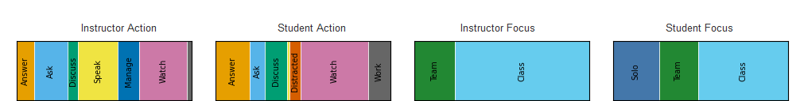
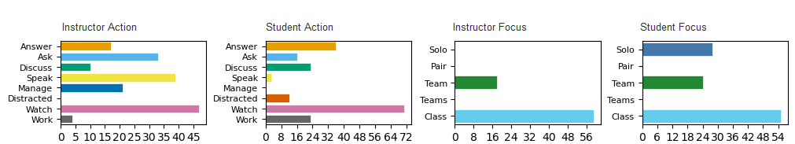
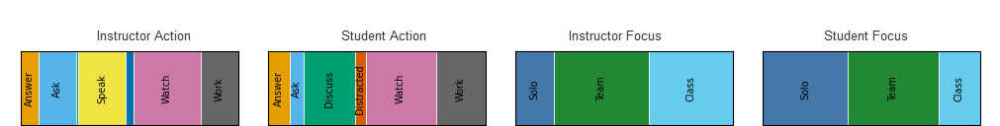
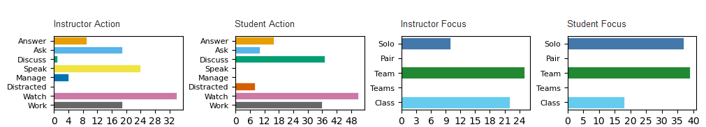

# Focus and Action of Students and Teachers Observation Protocol (FASTOP) <!-- omit in toc -->
- [What is FASTOP?](#what-is-fastop)
- [How to use FASTOP? (Quick Start)](#how-to-use-fastop-quick-start)
- [Who could use FASTOP?](#who-could-use-fastop)
- [What are the FASTOP codes?](#what-are-the-fastop-codes)
- [What FASTOP codes are typical for various classroom activities?](#what-fastop-codes-are-typical-for-various-classroom-activities)
- [What can analysis of FASTOP data show?](#what-can-analysis-of-fastop-data-show)
- [How does FASTOP differ from other observation protocols?](#how-does-fastop-differ-from-other-observation-protocols)
- [How to learn more?](#how-to-learn-more)

## What is FASTOP?

**FASTOP** is a classroom observation protocol intended to monitor the **focus** (e.g., solo, pair, team, or whole class) and **action** (e.g., discuss, speak/present, watch/listen, or distracted) of both **students** and **teachers** (instructors).

## How to use FASTOP? (Quick Start)

- Decide how to collect data:
    - Download & print the [blank grid](img/FASTOP-blank-grid.xlsx).
    - Use the [OPTIC App](https://optic.kussmaul.org).
- Check out a [sample datafile](). <!-- INCOMPLETE -->

## Who could use FASTOP?

- coaches and mentors of learner-centered practitioners
- experienced practitioners who want data on their classes
- administrators who evaluate teaching
- researchers who study learner-centered classrooms

## What are the FASTOP codes?

**Focus**  codes *who* students and teachers interact with, 
while **Action** codes *what* students and teachers do.

Thus, most observations will have 1+ focus codes and 1+ action codes for both students and teachers.

|   Focus Code | Student Focus                         | Teacher Focus                    |
| -----------: | ------------------------------------- | ------------------------------   |
|         Solo | Students act alone.                   | Teacher with one student.        |
|         Pair | Students act in pairs.                | Teacher with pair of students.   |
|         Team | Students act in teams/groups (3-5).   | Teacher with student team.       |
|        Teams | Students act across or between teams. | Teacher with multiple teams.     |
|        Class | Students act as whole class.          | Teacher with whole class.        |

|  Action Code | Student / Teacher Action                                                 |
| -----------: | ------------------------------------------------------------------------ |
|       Answer | Answer question(s) posed by other(s).                                    |
|          Ask | Ask question(s) and wait for other(s) to answer.                         |
|      Discuss | Talk back and forth (more than one question and answer).                 |
|        Speak | Talk by one person with no interaction.                                  |
|       Manage | Pass out or collect papers, assign groups, take attendance.              |
|   Distracted | Distracted or off task.                                                  |
| Watch/Listen | Watch or listen (e.g., to lecture or presentation).                      |
|         Work | Write, take notes, work on computer, etc. (not ask, answer, or discuss). |

## What FASTOP codes are typical for various classroom activities?

This table shows the expected FASTOP codes for various classroom activities.

| Activity                                               | Focus                                                   | Teacher (Instructor) Action                                     | Focus                                                | Student Action                                                 |
| -----------------------------------------------------: | ------------------------------------------------------: | --------------------------------------------------------------- | ---------------------------------------------------: | -------------------------------------------------------------- |
| Traditional Lecture                                    | Class                                                   | Speak                                                           | Class Pair Solo                              | Listen Discuss Work, Distracted                        |
| Computer Laboratory                                    | Class Solo, Pair                                    | Watch Discuss                                               | Solo Pair                                        | Work Work, Discuss                                         |
| POGIL a. teamwork  b. report out               | Class Team  Class                               | Watch Discuss  Ask, Discuss                             |  Team  Class                                 |  Discuss, Work  Answer                                 |
| Peer Instruction a. b. c. d. e. f. | Class Class Class Class Class Class | Speak, Ask Watch Speak, Ask Watch Ask Speak | Class Solo Class Pair Solo Class | Listen Answer Listen Discuss Answer Listen |

See below for a table and plots of FASTOP codes from real classrooms.

## What can analysis of FASTOP data show?

This table summarizes some preliminary data. 
Each row is a FASTOP code, grouped into student and teacher *focus*, and student and teacher *action*. 
Each column is a classroom activity: traditional lecture, interactive lecture, computer laboratory, POGIL team work, and POGIL report out.
Real classroom observation sessions were segmented based on the observed activity.
Code occurences were counted, and then normalized by the number of codes, so each block sums to 100%.
For each activity, the column lists the weighted averages; for clarity, values <10% have been replaced with an asterisk.

Thus, in a traditional lecture, the teacher mostly *speaks* to the whole *class*, 
while roughly half of students *watch/listen* and the rest are *distracted* or *work*.
In constrast, during POGIL teamwork, the teacher *watches/listens* roughly half of the time, but also *discusses*, *asks*, and *manages*, 
while students *discuss* and *work* roughly two-thirds of the time. 

|    Focus or Action | Code         | Trad. Lecture | Inter. Lecture | Comp. Lab | POGIL Team | POGIL Report |
| -----------------: | -----------: | ------------: | -------------: | --------: | ---------: | -----------: |
|  **Student Focus** | Solo         |            41 |              * |        61 |          * |            * |
|                    | Pair         |               |                |        33 |            |              |
|                    | Team         |               |             13 |         * |         88 |            * |
|                    | Teams        |               |                |           |          * |              |
|                    | Class        |            59 |             85 |         * |          * |           98 |
|                    |              |               |                |           |            |              |
|  **Teacher Focus** | Solo         |             * |                |        58 |         18 |              |
|                    | Pair         |               |                |        23 |          * |              |
|                    | Team         |             * |              * |         * |         53 |            * |
|                    | Teams        |               |                |         * |          * |              |
|                    | Class        |            96 |             91 |        13 |         21 |           92 |
|                    |              |               |                |           |            |              |
| **Student Action** | Answer       |             * |             22 |         * |         14 |           27 |
|                    | Ask          |             * |                |         * |          * |            * |
|                    | Discuss      |               |              * |        34 |         30 |            * |
|                    | Speak        |               |                |         * |          * |            * |
|                    | Manage       |               |                |           |          * |              |
|                    | Distracted   |            24 |             13 |         * |          * |           11 |
|                    | Watch/Listen |            51 |             40 |        16 |          9 |           45 |
|                    | Work         |            20 |             18 |        35 |         28 |           14 |
|                    |              |               |                |           |            |              |
| **Teacher Action** | Answer       |             * |                |        17 |          * |            * |
|                    | Ask          |             * |             31 |         * |         13 |           41 |
|                    | Discuss      |               |              * |        50 |         16 |              |
|                    | Speak        |            87 |             46 |         * |          * |           46 |
|                    | Manage       |             * |              * |         * |         12 |            * |
|                    | Distracted   |               |                |           |          * |              |
|                    | Watch/Listen |               |             13 |        17 |         40 |            * |
|                    | Work         |               |                |           |          * |              |
|                    |              |               |                |           |            |              |

The plot below shows actions and focus for instructors and students during an interactive lecture session: 

The plot below show actions and focus for instructors and students during a POGIL session: 

## How does FASTOP differ from other observation protocols?

An observation protocol embodies decisions about what will be observed. 
For example, the [*Classroom Observation Protocol for Undergraduate STEM (COPUS)*](http://www.cwsei.ubc.ca/resources/tools/copus.html) focuses on practices in *Peer Instruction*.
Similarly, the [*Observation Protocol for Teaching in Interactive Classes (OPTIC)*](https://pogil.org/pogil-tools/optic) focuses on practices in [*Process Oriented Guided Inquiry Learning (POGIL)*](https://pogil.org) and other forms of collaborative small-group learning.

We wanted to underestand what actually happens in a variety of class sessions, 
including lectures, lab activities, Peer Instruction, POGIL, etc.
Specifically, we wanted to analyze *what* students and teachers did (their **action**)
and *who* they interacted with (their **focus**).
For example, students could work with a team, a partner, or alone;
the instructor could speak to a single student, a team, or the whole class.

Thus, most COPUS and OPTIC codes map to multiple FASTOP codes.
Here is a [draft mapping between OPTIC, COPUS, and FASTOP](sub/fastop-mapping.md).

## How to learn more?

- FASTOP
    - C Kussmaul, PB Campbell, M Torres-Demas, C Mayfield, HH Hu (2023) [Introducing the Focus & Action of Students & Teachers Observation Protocol (FASTOP)](../research/2023/kussmaul-2023-fastop.md). *ASEE Annual Conference*. ([ASEE link](https://peer.asee.org/43856))
    - C Mayfield, C Kussmaul, HH Hu, PB Campbell (2024) [Exploring the impact of POGIL on student engagement](../research/2024/mayfield-2024-engage.md). *IUSE Summit*.
    - C Mayfield, PB Campbell, HH Hu, C Kussmaul (2025) [Exploring the impact of POGIL on student engagement](../research/2025/mayfield-2025-engage.md). *National Conference to Advance POGIL Practice (NCAPP)*.
- other observation protocols
    - RF Frey, U Halliday, S Radford, S Wachowski (2019) [Development of an observation protocol for teaching in interactive classrooms (OPTIC)](https://www.morressier.com/o/event/5fc642c603137aa525863c7c/article/5fc643a22d78d1fec4668269). *Abstracts of Papers of the American Chemical Society*.
    - MK Smith, FHM Jones, SL Gilbert, CE Wieman (2013) [The Classroom Observation Protocol for Undergraduate STEM (COPUS)](https://doi.org/10.1187/cbe.13-08-0154). *CBE - Life Sciences Education (LSE)* 12(4):618–627.
    - D Sawada, MD Piburn, E Judson, et al. (2002) [Measuring reform practices in science and mathematics classrooms: The Reformed Teaching Observation Protocol (RTOP)](https://doi.org/10.1111/j.1949-8594.2002.tb17883.x). *School Science & Mathematics* 102(6):245–253.
- comments or questions? 
    - contact [Clif Kussmaul](mailto:clif@kussmaul.org) or [Pat Campbell](mailto:campbell@campbell-kibler.com)
