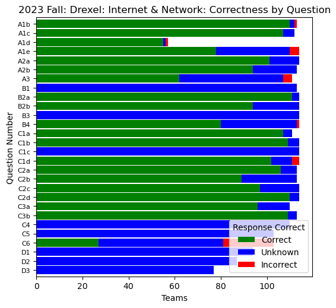
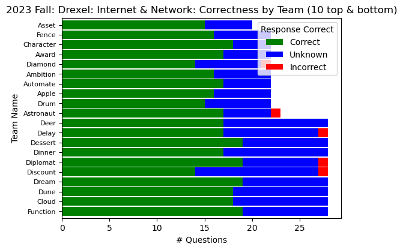

# Guided Inquiry Learning with Technology (GILT)

**Guided Inquiry Learning with Technology (GILT)** is a web platform to support POGIL-style approaches, particularly in large, virtual, and/or hybrid settings. GILT has been piloted since 2020 at multiple universities, mostly in computing and chemistry courses.

* Student teams access POGIL-style activities anonymously via a browser.
    * Models can be static or dynamic (e.g., interactive graphics, simulations, live code).
    * Questions can be text, multiple choice, or numeric sliders.
* Instructors can monitor team progress.
    * Team responses can be visualized in tables, bar or pie graphs, word trees, and other ways.
    * Team progress can be visualized in dashboards (see examples below).

For details, contact Clif Kussmaul [clif@kussmaul.org](mailto:clif@kussmaul.org).

A dashboard where each row is a **question**, showing the number of correct (green), incorrect (red), and unknown (blue) responses.

A dashboard where each row is a **team**, showing the number of correct (green), incorrect (red), and unknown (blue) responses.
